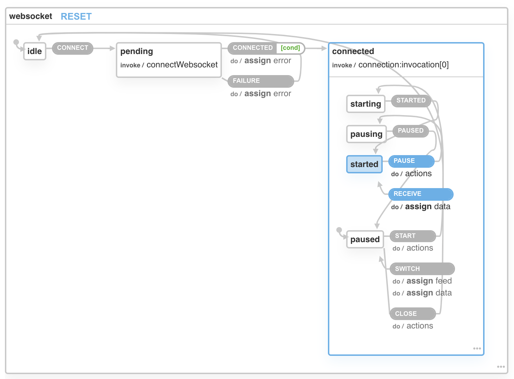

# Orderbook

This project is an experimental order book for two cryptocurrencies, Bitcoin and Ethereum. Prices are in USD.

What is an order book?
>The term order book refers to an **electronic list of buy and sell orders** for a specific security or financial instrument **organized by price level**. An order book **lists the number of shares** being bid on or offered at each price point, or market depth - Investopedia

## Getting Started

First, run the development server:

```bash
npm run dev
# or
yarn dev
```

Open [http://localhost:3000](http://localhost:3000) with your browser to see the result.


# Implementation

This project is implemented with [Next.js](https://nextjs.org/), bootstrapped with [`create-next-app`](https://github.com/vercel/next.js/tree/canary/packages/create-next-app).

State is implemented using [XState](https://github.com/statelyai/xstate).




## Performance
To monitor the performance, you can use the following bookmarklet:

```javascript
javascript:(function(){var script=document.createElement('script');script.onload=function(){var stats=new Stats();document.body.appendChild(stats.dom);requestAnimationFrame(function loop(){stats.update();requestAnimationFrame(loop)});};script.src='//mrdoob.github.io/stats.js/build/stats.min.js';document.head.appendChild(script);})()
```

## Deploy on Vercel

[](https://vercel.com/new/clone?repository-url=https%3A%2F%2Fgithub.com%2Fraresportan%2Forderbook)